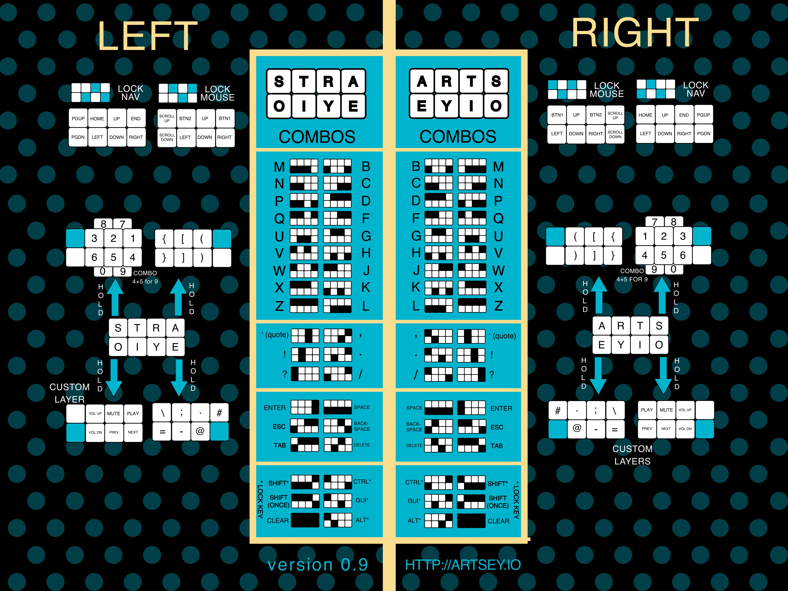

# KMK - ARTSEYIO

This is a repo containing the KMK files for the ARTSEYIO paintbrush keyboard.

I was originally just looking for a nice macropad to keep attached to my PC, once I built it and then looked around for the firmware I found that neither the ZMK or the QMK (that one scares me) work. So I decided to make it work with KMK which was much more successful. 

## Hardware
[Elite-Pi](https://docs.keeb.io/elite-pi-guide) -- I have 2 laying around since I ruined a lily58 pcb, looks pretty nice with the literal pi on the top of the tiny board. Hoever there is some custom wiring in my case... I think i'm developing an issue with burning out pins... (a ground pin was causing the board to reset and pin 20 needed wiring manually as it wasn't working via the pcb).

[Paintbrush](https://keebd.com/en-gb/products/paintbrush-keyboard-kit) -- The cool lil keeb.
    Note: I am not using the screen as for some reason it shorts the whole thing... I dunno...

> Especially [designed] for those with disabilities, those who cannot type on traditional keyboards and those that prefer not use traditional keyboards. The Paintbrush is reversible so can be built for either left/right hand use.

[ARTSEYIO](https://artsey.io/) -- More of a system for using one-handed keyboards.

## The System
The ARTSEYIO system looks like this, it is surprisingly easy to get to grips  with:

## Issues
So far the alphabet works, the combos that ARTSEYIO have used are pretty cool and feels reminiscent of old mobile phone keyboards. However, although it would work for me and what I need it to do. I think KMK is a very good and easy firmware with an easy installation for those that need it. So I thought in order to make life easier for those that actually _need_ the board, I may as well do the whole system. However, as with any project, there are issues:

- One Shot doesn't work, for me just importing the module stops the board from working which ( due to the style of the keyboard) means shift isn't really useful at all.

- Layer TAP do not work (yes i know they are currently not setup right in the main.py, however this is the script loaded on my paintbrush as of now). Adding the keymap including the layers, will cause those keys to not work.

- Layers are being a pain, full stop, adding the code for the number or nav layer will cause it to not work.